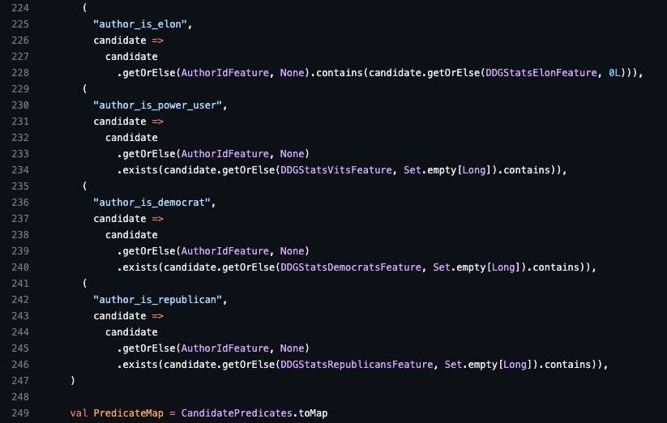

...Every evil has a name. Certain people are responsible for the lawlessness committed for political reasons - judges, investigators, prosecutors and many others. This site contains everything we know about them: https://black-book.wiki/search/

----

It's horrible. Read only to people with a strong psyche: https://github.com/zbroyar/mass_killings/blob/master/ru/Cleansing.md

----

Elon Musk is suspected of underreporting tweets about the war in Ukraine.  
  
On March 31st, Twitter posted part of the source code of the algorithm that is responsible for what the user_names gets into the recommendations. After studying the programmers, they came to the conclusion that tweets about the war in Ukraine went down in the rating: this means that the algorithm shows them less often in the feed.  
  
The category "UkraineCrisisTopic" is on a par with coordinated bullying, fakes, adult content and copyright infringement. However, it is not yet possible to reliably say whether tweets with these flags are downgraded in the SERPs, or if these flags receive tweets that users complain about, or they mean something else.  
  
Ukrainian Twitter users noticed that their tweets about the war began to collect fewer likes, reposts and comments after Elon Musk headed the social network in October last year.  
  
In addition, the Musk was suspected that the algorithm increases the issuance of his tweets. Markers for Musk, "power users", "Democrat users" and "Republican users" were found in the code. Twitter explained this by collecting statistics and comparing reactions to Musk's tweets with reactions to politicians' tweets.

Link to source code: https://github.com/search?q=repo%3Atwitter%2Fthe-algorithm+Ukrain&type=code

----

### Timeline:

Education:

- MOT ([MyOSINT.Training](http://myosint.training/)) will become your trusted source for OSINT (Open Source Intelligence) training. Our industry-leading trainers understand not only how to find data on the internet but teach how and why to use these techniques so everyone can follow along and get the most from these courses. Whether you work at a small, medium, or enterprise-sized company or are just interested in growing your OSINT skills, we have affordable courses to help.

Articles:

- Let me repeat that - Putin praises Telegram for its cooperation with the Russian authorities in the “fight against extremism”: https://kyivindependent.com/yaroslav-azhnyuk-why-doesnt-ukraine-restrict-use-of-the-russian-telegram-app/

Services:

- AnalyzeMyMailHeader: this tool will make your email header legible by parsing each record. Email headers are present on every email you receive via the Internet, the email header is generated by the client mail program that first sends it and by all the mail servers en route to the destination: [https://mailheader.org/](https://mailheader.org/)

Guides:

- How to analyze malware PDF documents: https://spy-soft.net/analysing-malicious-pdf-documents/

Tools:

- Investigator helps you quickly check and gather information about the target domain name: https://abhijithb200.github.io/investigator/

- ReconAIzer: a Burp Suite extension to add OpenAI to Burp to help you with your Bug Bounty recon: https://github.com/hisxo/ReconAIzer

- Take back your privacy. Lose yourself in the haystack. Your ISP is most likely tracking your browsing habits and selling them to marketing agencies (albeit anonymised). Or worse, making your browsing history available to law enforcement at the hint of a Subpoena. Needl will generate random Internet traffic in an attempt to conceal your legitimate traffic, essentially making your data the Needle in the haystack and thus harder to find. The goal is to make it harder for your ISP, government, etc to track your browsing history and habits: https://github.com/eth0izzle/Needl

- An advanced Twitter scraping & OSINT tool written in Python that doesn't use Twitter's API, allowing you to scrape a Tweets and more while evading most API limitations: https://github.com/achyuthjoism/tweeds

- gitGraber: monitor GitHub to search and find sensitive data in real time for different online services such as: Google, Amazon, Paypal, Github, Mailgun, Facebook, Twitter, Heroku, Stripe: https://github.com/hisxo/gitGraber

- SecLists is the security tester's companion. It's a collection of multiple types of lists used during security assessments, collected in one place. List types include usernames, passwords, URLs, sensitive data patterns, fuzzing payloads, web shells, and many more. The goal is to enable a security tester to pull this repository onto a new testing box and have access to every type of list that may be needed: https://github.com/hisxo/SecLists

- Pipeline of a keylogging attack using just an audio signal and unsupervised learning: https://github.com/shoyo/acoustic-keylogger

- Domain_checker application is the trial/demo version for the new EASM (External Attack Surface Management) system called HydrAttack (hydrattack.com), the main idea of which is, based only on the domain name, find almost all of the subdomains and their top 100 open ports: https://github.com/IvanGlinkin/Domain_checker

- Have you ever faced with the lack of possibility of using NMap? For instance if you have reverse shell as an unprivileged user and there are no useful tools preinstalled? This is a small script which will help you to scan a network for live hosts and top 24 ports if you have nothing: https://github.com/IvanGlinkin/Host-enumeration

- Have you ever faced with the lack of possibility of using NMap? For instance if you have reverse shell as an unprivileged user and there are no useful tools preinstalled? This is a small script which will help you to scan a network if you have nothing: https://github.com/IvanGlinkin/Port-enumeration

- A modern alternative network traffic sniffer: https://github.com/chenjiandongx/sniffer

----

bormaxi8080 OSINT timeline:

GitHub: [https://github.com/bormaxi8080/osint-timeline](https://github.com/bormaxi8080/osint-timeline)

You can see Systematized [List](https://github.com/bormaxi8080/github-starred-repos-builder/blob/main/starred_repos.md) of my GitHub starred OSINT and Development Tools repositories, same [group by GitHub topics list](https://github.com/bormaxi8080/starred)

[bormaxi8080 OSINT Featured Timeline on LinkedIn](https://www.linkedin.com/in/maxim-marshak/details/featured/)

----
