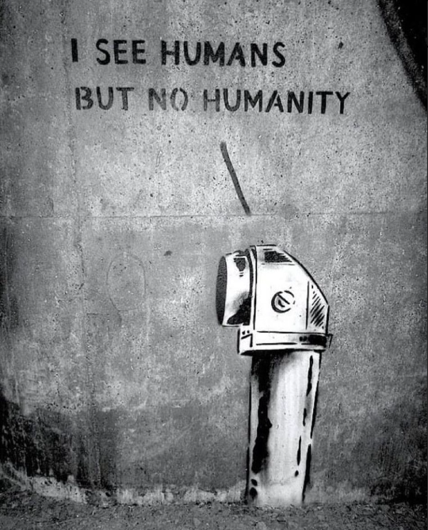

...I imagined here: you wake up in the morning, look at the monitors, and there is a nebula in the constellation Canis Major, 15 thousand light years from the Earth. A tough day ahead: wake up the crew, explore a couple of planetary systems, sort out navigation, send out reports...

The great science fiction writers were right: the essence should not even be in ourselves, but only in what we can become in ten, a hundred, a thousand years - in order to realize what the great science fiction writers thought about.

That's when God is very close.

And in the meantime, we are all about war, money and braces...

----
### bormaxi8080 OSINT Timeline (04) - 27.04.2023:

--

The GRU leadership oversees the Silk Road International Automobile Rally project, which it uses as an infrastructure for its residents and to establish political contacts. Documents obtained by The Insider testify to this. As can be seen from the telephone connections, the official director of the rally was in constant contact with the officers from military unit 29155, who were involved in the explosions of military warehouses and poisoning with chemical weapons.

https://theins.ru/politika/261148

----

A [Digital Forensic Research Lab (DFRLab)](https://www.linkedin.com/company/dfrlab/) analysis of three state controlled media networks in [#Russia](https://www.linkedin.com/feed/hashtag/?keywords=russia&highlightedUpdateUrns=urn%3Ali%3Aactivity%3A7055223734848090112), [#China](https://www.linkedin.com/feed/hashtag/?keywords=china&highlightedUpdateUrns=urn%3Ali%3Aactivity%3A7055223734848090112), and [#Iran](https://www.linkedin.com/feed/hashtag/?keywords=iran&highlightedUpdateUrns=urn%3Ali%3Aactivity%3A7055223734848090112) found that following a changed in [Twitter](https://www.linkedin.com/company/twitter/)'s policy on the promotion of state affiliated media accounts, the once hemorrhaging accounts saw a dramatic uptick in followers in late March and early April.  
  
Following the investigation, [NPR](https://www.linkedin.com/company/npr/) confirmed Twitter made the deliberate decision to stop filtering government accounts in Russia, China, and Iran.  
  
See how dramatic the upticks were: https://dfrlab.org/2023/04/21/state-controlled-media-experience-sudden-twitter-gains-after-unannounced-platform-policy-change/

----

### Articles:

Wireshark Filters for Security Analyst: https://www.socinvestigation.com/wireshark-filters-for-security-analyst/

----

### Tools:

- ```Katana``` - A next-generation crawling and spidering framework: https://github.com/projectdiscovery/katana

- ```eNgine``` is an automated reconnaissance framework for web applications with a focus on highly configurable streamlined recon process via Engines, recon data correlation and organization, continuous monitoring, backed by a database, and simple yet intuitive User Interface. reNgine makes it easy for penetration testers to gather reconnaissance with…
   https://github.com/yogeshojha/rengine

- Fast and lightweight, ```UDPX``` is a single-packet UDP scanner written in Go that supports the discovery of over 45 services with the ability to add custom ones. It is easy to use and portable, and can be run on Linux, Mac OS, and Windows. Unlike internet-wide scanners like zgrab2 and zmap, UDPX is designed for portability and ease of use: https://github.com/nullt3r/udpx

- ```PowerMeUp``` - A small library of powershell scripts for post exploitation that you may need or use! It is also a custom reverse shell that you can use to add modules of your choice and not be stuck to things you do not need or use: https://github.com/ItsCyberAli/PowerMeUp

-  ```The Volatility Framework``` is a completely open collection of tools, implemented in Python under the GNU General Public License, for the extraction of digital artifacts from volatile memory (RAM) samples. The extraction techniques are performed completely independent of the system being investigated but offer visibilty into the runtime state of the system. The framework is intended to introduce people to the techniques and complexities associated with extracting digital artifacts from volatile memory samples and provide a platform for further work into this exciting area of research: https://github.com/volatilityfoundation/volatility

----
### bormaxi8080 OSINT timeline:

GitHub: [https://github.com/bormaxi8080/osint-timeline](https://github.com/bormaxi8080/osint-timeline)

LinkedIn: [bormaxi8080 OSINT Featured Timeline](https://www.linkedin.com/in/osintech/details/featured/)

You can see Systematized list of my [GitHub Starred OSINT Repositories](https://github.com/bormaxi8080/osint-repos-list)

and contact me on Twitter: [https://twitter.com/OSINTech_](https://twitter.com/OSINTech_)

----

If you like the projects that I do, I will be grateful for donations in private dialogue.

----

WARNING! All tools, programs and techniques published in this repository are used for informational, educational purposes or for information security purposes. The authors are not responsible for the activities that users of these tools and techniques may carry out, and urge them not to use them to carry out harmful or destructive activities directed against other users or groups on the Internet.