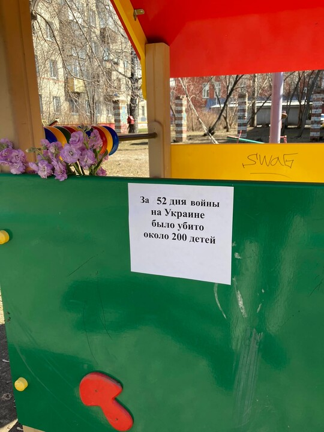

The cover photo was taken by me a year ago in Novosibirsk, Russia. "During the 52 days of the war, about 200 children were killed in Ukraine". The author of the action is unknown.

----
### bormaxi8080 OSINT Timeline (04) - 04.05.2023:

--

The death and revival of Russian occupation telegram channels: https://www.linkedin.com/pulse/death-revival-russian-occupation-telegram-channels-maxim-marshak, souce: https://texty.org.ua/articles/109498/smert-i-vidrodzhennya-rosijskyh-okupacijnyh-telehram-kanaliv/

Telegram channels and groups catalog: https://tgstat.ru/en

```Telegram-OSINT``` - Separate Repository for Telegram as there is a large amount of resources available: https://github.com/cqcore/Telegram-OSINT

Regarding the analysis of data and the analysis of disinformation in social networks. The trouble for many journalists now is not even fact-checking, but their possession of technology at a level sufficient to quickly identify misinformation online. Well, that is, they know how to broadcast and present information, but they cannot master complex equipment. Well, coordination and mutual support, of course.

To have at least some idea of the complexity of the technique that is used for such analysis, you can see a recent article on hate speech analysis in Telegram by Benjamin Strick ( https://www.linkedin.com/in/bendobrown/ )

Incitement to Kill: Tracking hate speech targeting Ukrainians during Russia’s war in Ukraine, tyts: https://www.info-res.org/post/incitement-to-kill-tracking-hate-speech-targeting-ukrainians-during-russia-s-war-in-ukraine

In order to work with such, you need a lot of experience and even more great awareness.
Well, a couple of thousands of utilities with which such data is collected.

```Telegram Keyword Trends``` - an analysis tool to explore the emergence of hatespeech, disinformation, and narratives of interest on the Telegram chat platform. Please use this tool with caution as it does not have content moderation or filtering. You are responsible for the content that may be exported: https://github.com/thomasjjj/tg-keyword-trends

```Gephi```: https://gephi.org/

And that's just a drop in the ocean...

----
### bormaxi8080 OSINT timeline:

GitHub: [https://github.com/bormaxi8080/osint-timeline](https://github.com/bormaxi8080/osint-timeline)

LinkedIn: [bormaxi8080 OSINT Featured Timeline](https://www.linkedin.com/in/osintech/details/featured/)

You can see Systematized list of my [GitHub starred OSINT and Development Tools repositories](https://github.com/bormaxi8080/github-starred-repos-builder/blob/main/starred_repos.md)
and contact me on Twitter: [https://twitter.com/OSINTech_](https://twitter.com/OSINTech_)

----
### If you like the projects that I do, I will be grateful for donations:

USDT (TRC-20): TBq4LYHbRGVEZ2BvDq88rmadvsHvfwRzyf

ETH (ERC-20): 0xd1f0b91cf5430ea6cd5f853dbedb1134f2e1af35

ETH: 0xE29685D6f0032Bccac08B0E745a1A69ef9803973

BTC: 1P8UgziH27TuGTo9GK3cnKLh9JhECYDeuo

----

WARNING! All tools, programs and techniques published in this repository are used for informational, educational purposes or for information security purposes. The authors are not responsible for the activities that users of these tools and techniques may carry out, and urge them not to use them to carry out harmful or destructive activities directed against other users or groups on the Internet.