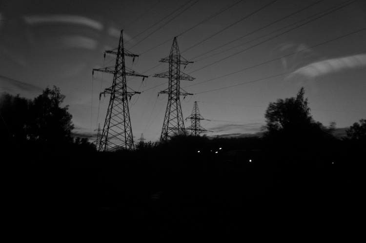

...My homeland is Uncle Bakhyt in the village of Kyzyl-Tau, burning sun, wide steppe and beshparmak. This is football with a rubber ball or on a bike to the Nura River. Falcon nests on dried poplars, herds of red cows. This is homeland. Homeland flowering chestnuts in 2000 near Zhytomyr. Apple orchard. We are walking through the village of Polyanki, and the girls are laughing after us? Beautiful girls by the way. I remember one surname was Saint. She really stepped off the icon. I remember how we sat on the shore of a pond in the village of Baranivka and prayed for the Russian sailors on the Kursk.

I met my homeland on a Polish forest path not far from Krakow. She was the color of a salamander that crawled out to bask in the sun after a long rain. There was a homeland in the Tomsk taiga, where we went to shoot remote villages, and there I caught a 4 kg bream. Old huts on the Moscow highway. The hard labor path along which the Decembrists passed. Homeland Tobolsk Kremlin with its dungeons. And bear tracks by the car in which we spent the night with a gentle beauty. In 2008, the German bar was home. It's hot, June, and we unfamiliar Dutchmen support European football together. The Indian nuns who came to help the homeless in Siberia was my homeland. In amateur performances and in conversations until midnight. At dawn over the Ob.

And now she's gone. There is no my homeland. Part of her cries and suffers. The other part is crazy, Nazi, fighting. This part is ruled by bastards that are bombing the Zhytomyr region with its chestnuts. Guards who promise six years in the camps for calling everything by its proper name. There is, for example, General Kartapolov, who in 2014 was in charge of Bukami, who shot down a Dutch plane. So he just asks for 6 years to everyone who dares to blurt something against their homeland. This is his home. He is so accustomed, they are so accustomed. Instill love in yourself with a stick and a camp. Let them live in their homeland. Let them plant each other. Scribbling denunciations. I don't fucking need her. I took my homeland with me.

Petr Sokolov

----

BiZness as usual: 25 European companies still supplying the Russian army: https://theins.ru/en/economics/261792

----

The most unusual OSINT guide you've ever seen. The repository is intended for bored professionals only. PRs are welcome: https://github.com/OffcierCia/non-typical-OSINT-guide

----

### Tools:

```Fierce``` - a DNS reconnaissance tool for locating non-contiguous IP space: https://github.com/mschwager/fierce

```Arkime``` (formerly Moloch) is an open source, large scale, full packet capturing, indexing, and database system: https://github.com/arkime/arkime
Website: https://arkime.com/

Decryption of a PDF file with calculation of Time - Hash - Metadata: https://github.com/CScorza/BruteForceDecryptPDF/

```TLDHunt``` is a command-line tool designed to help users find available domain names for their online projects or businesses. By providing a keyword and a list of TLD (top-level domain) extensions, TLDHunt checks the availability of domain names that match the given criteria. This tool is particularly useful for those who want to quickly find a domain name that is not already taken, without having to perform a manual search on a domain registrar website: https://github.com/yuyudhn/TLDHunt

```xurlfind3r``` - a CLI utility to find domain's known URLs passively from AlienVault's Open Threat Exchange, Common Crawl, Github, Intelligence X, URLScan, and the Wayback Machine: https://github.com/hueristiq/xurlfind3r

```Dome``` - Subdomain Enumeration Tool. Fast and reliable python script that makes active and/or passive scan to obtain subdomains and search for open ports: https://github.com/v4d1/Dome

```Cbrutekrag``` - Penetration tests on SSH servers using brute force or dictionary attacks. Written in C: https://github.com/matricali/cbrutekrag

A simple script just made for self use for bypassing 403: https://github.com/iamj0ker/bypass-403

```Recce``` - Domain availbility checker: https://github.com/unstabl3/recce

----

bormaxi8080 OSINT timeline:

GitHub: [https://github.com/bormaxi8080/osint-timeline](https://github.com/bormaxi8080/osint-timeline)

You can see Systematized [List](https://github.com/bormaxi8080/github-starred-repos-builder/blob/main/starred_repos.md) of my GitHub starred OSINT and Development Tools repositories, same [group by GitHub topics list](https://github.com/bormaxi8080/starred)

[bormaxi8080 OSINT Featured Timeline on LinkedIn](https://www.linkedin.com/in/osintech/details/featured/)

If you like the projects that I do, I will be grateful for donations in ETH: 0xE29685D6f0032Bccac08B0E745a1A69ef9803973

----
