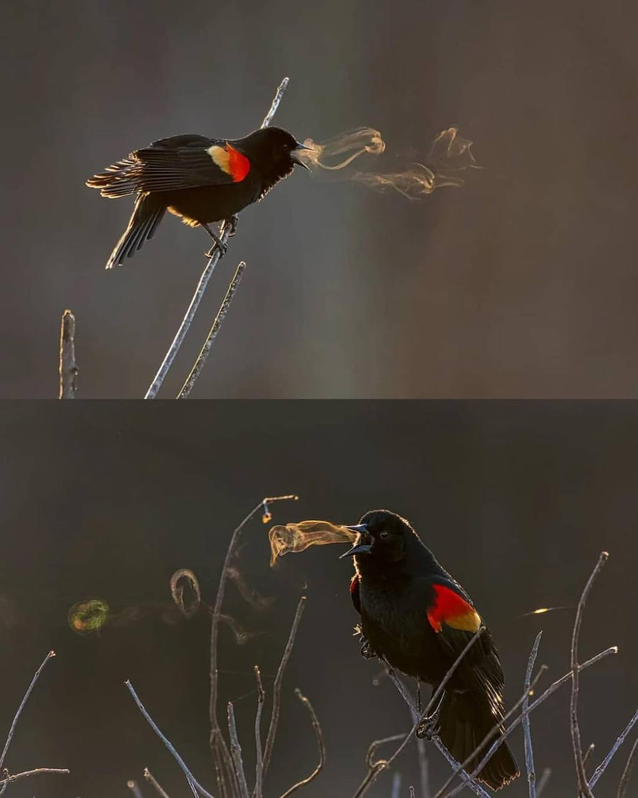

### bormaxi8080 OSINT Timeline (86) - 28.11.2024:

Whoever throws a stone at us,
We will beat him with bread:

He will eat our bread,
He will drink our wine,
Until he is sated to the full,
Until his belly grows heavy,
Until his limbs grow soft,
Until his eyes are covered with a cloudy film of satiety,
And his hand can no longer lift a stone.

And then the elder will rise and say:

Eat, eat, little brother,
And go to bed.
There will be no more hunger.
Tomorrow it will rain.

----

```OSINT Repos List```, Repository with gathered from GitHub utilities for OSINT, Development and DevOps. The number of artifacts in the repository exceeded 2300: https://github.com/bormaxi8080/osint-repos-list

----

```WHO I AM```. Chrome extension which allows to select a word and quickly check it from the context menu using different tools for nickname enumeration: WhatsMyNameApp and Sherlock: https://chromewebstore.google.com/detail/who-am-i/gdnhlhadhgnhaenfcphpeakdghkccfoo

----

**OSINT Tools, Services and Investigations:**

```yt-fts``` - YouTube Full Text Search - Search all of a YouTube channel from the command line: https://github.com/NotJoeMartinez/yt-fts

```Pipet``` - Swiss-army tool for scraping and extracting data from online assets, made for hackers: https://github.com/bjesus/pipet

----

**Universal Search & AI:**

```Letta``` (formerly MemGPT) is a framework for creating LLM services with memory: https://github.com/letta-ai/letta

---

**Software Development:**

```Authorizer``` is an open-source authentication and authorization solution for your applications. Bring your database and have complete control over the user information: https://github.com/authorizerdev/authorizer

```My Python Eggs``` - little programs as experiments to play with Python: https://github.com/geekcomputers/Python

----

**Linux & DevOps:**

```NeoHTop``` -  htop on steroids: https://github.com/Abdenasser/neohtop

----

**Flipper Zero & Other Devices:**

```Flipper Zero Unleashed Firmware```: https://github.com/DarkFlippers/unleashed-firmware

----

**New from CyberDetective:**

Sometimes it can be difficult to determine if photos taken at different ages belong to the same person. In such a situation, this tool will help: https://6mzld2.csb.app

If reverse facial photo search did not yield results, try processing the photo with AI age filter and add 10-20 years. Here are some examples of tools:

media.io/lab/ai-face-editor/

fotor.com/features/old-filter/

reface.ai/unboring/features/old-face-filter

ailab.wondershare.com/tools/aging-filter.html

----

**New from GitHub Community:**

```Obtainium``` - Get Android app updates straight from the source: https://github.com/ImranR98/Obtainium

----
### bormaxi8080 OSINT timeline:

GitHub: [https://github.com/bormaxi8080/osint-timeline](https://github.com/bormaxi8080/osint-timeline)

LinkedIn: [bormaxi8080 OSINT Featured Timeline](https://www.linkedin.com/in/osintech/details/featured/)

You can see Systematized list of my [GitHub Starred OSINT Repositories](https://github.com/bormaxi8080/osint-repos-list)

and contact me on Twitter: [https://twitter.com/OSINTech_](https://twitter.com/OSINTech_)

If you like the projects that I do, I will be grateful for donations in private dialogue.

----

WARNING! All tools, programs and techniques published in this article and repository are used for informational, educational purposes or for information security purposes. The authors are not responsible for the activities that users of these tools and techniques may carry out, and urge them not to use them to carry out harmful or destructive activities directed against other users or groups on the Internet.