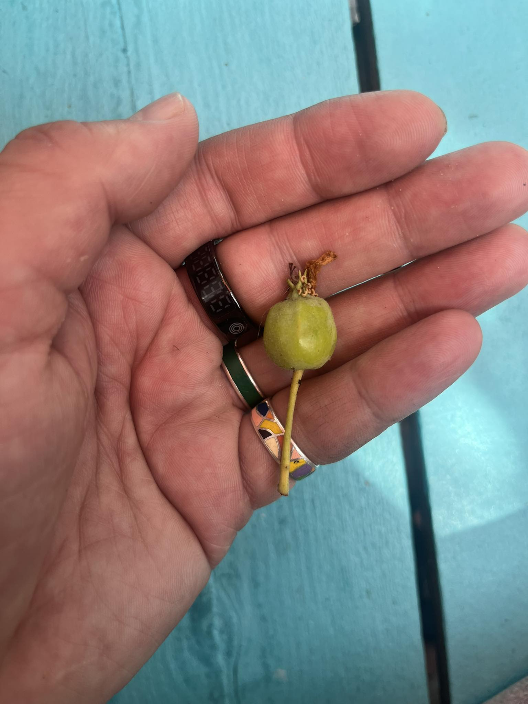

The melancholy of an ungrown apple.

----

```OSINT Repos List```, Repository with gathered from GitHub utilities for OSINT, Development and DevOps. The number of artifacts in the repository exceeded 2700: https://github.com/bormaxi8080/osint-repos-list

----

**OSINT Tools, Services and Investigations:**

```R00M 101 OSINT Tools Directory```. 113+ tools for social media intelligence, archiving, automation, downloading, monitoring, scraping, searching and more: https://r00m101.com/tools

A list of OSINT resources and tools that may be useful to you when conducting investigations related to the ```Republic of Iraq```: https://github.com/paulpogoda/OSINT-Tools-Iraq

```Ubikron```. You probably know Roelof Temmingh as the man who created Maltego 17 years ago, and who has been working on the Vortimo tool for the last few years. A few days ago he released Ubikron, a tool for tracking, tagging, and saving web investigations: https://www.ubikron.com/

```Subscrape```. Python tool to search subdomains and extract titles, urls, emails, tokens and any other information from the HTML code of their main pages using regular expressions: https://github.com/cesc0sec/SecResearch

```GroupDa```. A search engine for finding Telegram groups, useful for gathering intelligence from public and private communities within Telegram: https://groupda.com/telegram/group/find

```Depix``` is a PoC for a technique to recover plaintext from pixelized screenshots: https://github.com/spipm/Depixelization_poc

```WebScrapBook```. A browser extension that captures web pages to local device or backend server for future retrieval, organization, annotation, and edit. This project inherits from legacy Firefox add-on ScrapBook X: https://github.com/danny0838/webscrapbook

----

**Universal Search & AI:**

```Index```. The SOTA Open-Source Browser Agent for autonomously performing complex tasks on the web: https://github.com/lmnr-ai/index

```Docling``` simplifies document processing, parsing diverse formats - including advanced PDF understanding - and providing seamless integrations with the gen AI ecosystem: https://github.com/docling-project/docling

----

**Software Development & APIs:**

```Lingui```. A readable, automated, and optimized (3 kb) internationalization for JavaScript: https://github.com/lingui/js-lingui?tab=readme-ov-file

----

**Linux & DevOps:**

```Ubicloud```. Open source alternative to AWS. Elastic compute, block storage (non replicated), firewall and load balancer, managed Postgres, and IAM services in public beta: https://github.com/ubicloud/ubicloud

----

**Flipper Zero & Other Devices:**

```Segger Embedded Studio``` project for building & debugging Flipper Zero firmware: https://github.com/hedger/flipperzero-sesproject

----

**New from CyberDetective:**

```Essential OSINT tools for journalists investigating air pollution```. Tracking real-time air pollution, identifying pollution sources, identifying the polluters, tracking air pollution over time: https://ijnet.org/en/story/essential-osint-tools-journalists-investigating-air-pollution

----

**New from GitHub Community:**

```BountyOS```. New Linux distro for different cybersecurity tasks: based on Debian 12, 75+ tools, simple installation (ISO file): https://bountyos.github.io/

----

### OSINTech's Timeline

LinkedIn: [OSINTech's Featured Timeline](https://www.linkedin.com/in/osintech/details/featured/)

SubStack: [OSINTech's Substack](https://osintech.substack.com)

----

WARNING! All tools, programs and techniques published in this article and repository are used for informational, educational purposes or for information security purposes. The authors are not responsible for the activities that users of these tools and techniques may carry out, and urge them not to use them to carry out harmful or destructive activities directed against other users or groups on the Internet.
