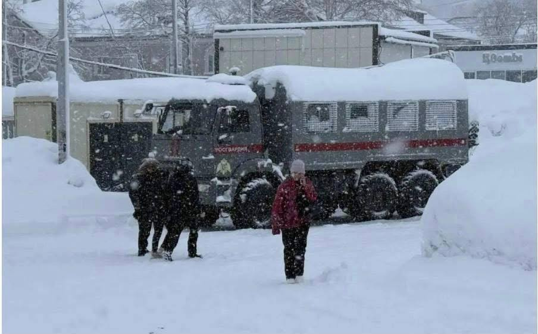

# OSINTech’s Timeline #148

drowning in generated content

the world stands in line for 

virtual bread

virtual bread

virtual bread

----

**Week of 30 January — 6 February 2026**

Every week, I manually curate tools, research, and services that are genuinely useful for OSINT, digital investigations, security research, and adjacent fields.

No hype. No SEO noise. No "AI startups that change everything".  
Only things you can **open, verify, and actually use**.

----

## 🧭 Featured Project

### **Tesari — OSINT Copilot**

> A first step for investigations into organized crime, corruption, trafficking, and global risk networks.

Tesari is designed as an entry point into complex investigations: structure, context, and navigable intelligence instead of chaotic searching.

What does “jurisdictional coverage” really mean for Tesari?

🔺  Local specialists vs Built-in jurisdiction knowledge

"Organizations often rely on local experts to support regional investigations. Tesari natively understands jurisdiction-specific nuances --> not to replace experts, but to narrow down and clarify the subject of interest."

🔺 Language barriers vs Local-language intelligence

"Language gaps often lead to missed or misinterpreted information.

Tesari searches in local languages and validates findings in context."

🔺 Fragmented data sources vs One investigative workspace

"Global investigations usually require expensive and complex combinations of local and international databases (10+ sources).

Tesari integrates these sources into a single, unified investigation flow, making it a one-stop shop for cross-border research."

🔺  Manual regulation and geopolitical analysis vs Contextual validation

"Investigators must understand local regulations and geopolitics to detect misinformation.

Tesari understands local specifics and flags potential disinformation, enabling investigators to validate information faster and more consistently"

🔺  Hard-to-reach regions vs Built-in access

"Some regions remain inaccessible or extremely difficult to research.

Tesari covers the most restricted jurisdictions like China and Russia. Expanding further is a matter of time."

Jurisdictional coverage isn’t about more data --> It’s about seeing clearly.

🔗 [https://tesari.ai](https://tesari.ai/)

----

## 🌍 BROWSER SANDBOXES  
  
There are situations when you want to visit a website, but you are not sure about its reliability, or you do not want to share your unique browser fingerprinting with the site, or simply something is not working in your browser and you want to try if it will work in another one.  
  
In this case, you can visit the website in a browser sandbox. Here are a few examples of such services (some of them are free and some are partially free)

🔗 https://www.browserling.com/

🔗 https://www.wannabrowser.net/

🔗 https://browser.lol/

🔗 https://browser.networkchuck.com/

🔗 https://www.testmu.ai/cross-browser-testing/

----
## 🌍 Regional & Thematic OSINT

**OSINT of Latvia**  

A country-focused OSINT resource set from UNISHKA Research Service, useful for regional analysis and verification.  

🔗 https://substack.com/home/post/p-185818226

**Canada OSINT**
- maps  
- police/legal  
- finance/property  
- transportation  
- news  
- government databases  
- business/corporation

🔗 https://start.me/p/9E5BLR/canosint

**Epstein Document Network Explorer**. An intelligent document analysis and network visualization system that processes legal documents to extract relationships, entities, and events, then visualizes them as an interactive knowledge graph

🔗 https://github.com/maxandrews/Epstein-doc-explorer

----

## 🛠 OSINT Tools, Services & Investigations

**P2T (Pix2Text)**. An Open-Source Python3 tool with SMALL models for recognizing layouts, tables, math formulas (LaTeX), and text in images, converting them into Markdown format. A free alternative to Mathpix, empowering seamless conversion of visual content into text-based representations. 80+ languages are supported
🔗 https://github.com/breezedeus/pix2text

**Obsidian OSINT Entity Extractor**. A tool for open source intelligence analysts to extract structured data from web articles
🔗 https://github.com/thomasjjj/Obsidian-OSINT-Entity-Extractor

**LiveContainer** is an app launcher (not emulator or hypervisor) that allows you to run iOS apps inside it
🔗 https://github.com/LiveContainer/LiveContainer

**GGWave**. Tiny data-over-sound library
🔗 https://github.com/ggerganov/ggwave

**Device Activity Tracker**. This project implements the research from the paper **"Careless Whisper: Exploiting Silent Delivery Receipts to Monitor Users on Mobile Instant Messengers"** by Gabriel K. Gegenhuber, Maximilian Günther, Markus Maier, Aljosha Judmayer, Florian Holzbauer, Philipp É. Frenzel, and Johanna Ullrich (University of Vienna & SBA Research)
🔗 https://github.com/Xh4H/WhatsApp-device-activity-tracker

The Firehound project is scanning and indexing apps that expose and leak sensitive user data in AppStore
🔗 https://firehound.covertlabs.io/

**ReconSwarm** is a modular reconnaissance automation framework designed for distributed security testing. It provisions cloud infrastructure, executes parallel reconnaissance pipelines, and collects results with minimal configuration overhead
🔗 https://github.com/renatus-cartesius/reconswarm

**Donut Browser**. A powerful anti-detect browser that puts you in control of your browsing experience. 
- Create unlimited number of local browser profiles completely isolated from each other
- Safely use multiple accounts on one device by using anti-detect browser profiles, powered by [Camoufox](https://camoufox.com/)
- Proxy support with basic auth for all browsers
- Import profiles from your existing browsers
- Automatic updates for browsers
- Set Donut Browser as your default browser to control in which profile to open links
🔗 https://github.com/zhom/donutbrowser

**Camoufox**. An open source anti-detect browser with robust fingerprint injection
🔗 https://camoufox.com/

----

## 🤖 Universal Search & AI

**RapidOCR**. Awesome OCR multiple programing languages toolkits based on ONNXRuntime, OpenVINO, PaddlePaddle and PyTorch
🔗 https://github.com/RapidAI/RapidOCR

**Pacta** turns software architecture into versioned, queryable data - so teams can see, compare, and reason about architectural change over time, not just block violations
🔗 https://github.com/pacta-dev/pacta-cli

----

## 👨‍💻 Software Development & APIs

**Auto Claude**. Autonomous multi-agent coding framework that plans, builds, and validates software for you
🔗 https://github.com/AndyMik90/Auto-Claude

[OpenAuth](https://openauth.js.org/) is a standards-based auth provider for web apps, mobile apps, single pages apps, APIs, or 3rd party clients. It is currently in beta
🔗 https://github.com/anomalyco/openauth

----

## 🐧 Linux & DevOps

**The WebDeck** is a Flask application that allows users to control their computer remotely from any device with a browser and a touchscreen. Unlike Elgato's StreamDeck, which requires physical equipment, WebDeck uses a Flask application that the user hosts on their computer
🔗 https://github.com/Lenochxd/WebDeck

**Sloggo**. Minimal RFC 5424 syslog collector and viewer based on DuckDB. Runs as a single, resource-friendly process
🔗 https://github.com/phare/sloggo/

**Docker-Android**. Android in docker solution with noVNC supported and video recording
🔗 https://github.com/budtmo/docker-android

**ProxSave**. Backup tool for Proxmox PBS & PVE System Files with advanced features and notifications
🔗 https://github.com/tis24dev/proxsave

----

## 🔌 Hardware & Devices

Develop applications and payloads for Spot using the **Boston Dynamics Spot SDK**
🔗 https://github.com/boston-dynamics/spot-sdk

A repo to share resources related to **Spot Robot configurations for hospital applications**
🔗 https://github.com/boston-dynamics/bosdyn-hospital-bot

----

## 🚨 From CyberDetective

**TrinetLayer**. Online tools for bugbounty hunters. Subdomain scanner, CVE scanner, JS analyzer, Live Exploit Sandbox, a lot of useful info about modern vulnerabilities
🔗 https://trinetlayer.com/

**SOAR ATLAS**. A huge, incredibly huge collection of maps, live maps (weather, fire, clouds), historic maps (worldwide, countries, towns), local conflicts and disasters maps, satellite maps, ability to upload your own maps
🔗 https://soaratlas.com/

----
## 📌 Where to Follow

- **Substack:** https://osintech.substack.com  
- **LinkedIn:** https://www.linkedin.com/in/osintech/details/featured/

If this timeline saves you time, it’s doing its job.  
Free to read. Manually curated. Minimal noise.

---

## 📌 Donates

---

## 📌 Legal and ethical note

All tools and techniques documented in the dataset are presented for informational,  
educational and information security purposes only.

The dataset does not promote or endorse illegal activities.  
Users are responsible for complying with applicable laws and ethical standards.

---

## 📌 About future updates

The dataset is updated on a regular basis.  
Future posts will document changes, notable additions and emerging trends observed within the dataset.

This post serves as an introduction and reference point for those updates.
