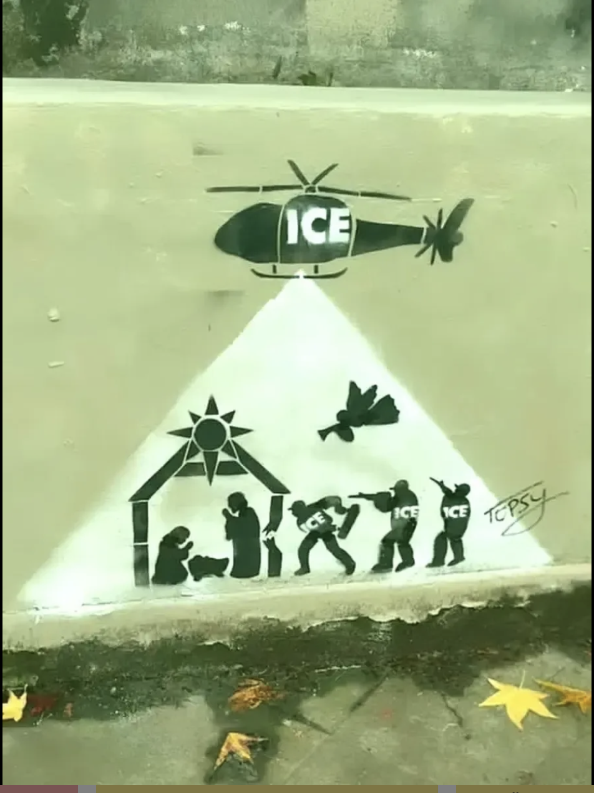

# OSINTech’s Timeline #157

MAGA

----

**Week of 3 — 9 April 2026**

Every week, I manually curate tools, research, and services that are genuinely useful for OSINT, digital investigations, security research, and adjacent fields.

No hype. No SEO noise. No "AI startups that change everything".  
Only things you can **open, verify, and actually use**.

----

## 🧭 Featured Project

### **Tesari — OSINT Copilot**

> A first step for investigations into organized crime, corruption, trafficking, and global risk networks.

**Tesari** is designed as an entry point into complex investigations: structure, context, and navigable intelligence instead of chaotic searching.

🔗 https://www.tesari.ai

----

## 🌍 Regional & Thematic OSINT

2**5 Satellite Maps** To See Earth in New Ways

🔗 https://gisgeography.com/satellite-maps/

**GitHub Store.** A free, open-source app store for GitHub releases — browse, discover, and install apps with one click. Powered by Kotlin and Compose Multiplatform for Android & Desktop (Linux, MacOS, Windows)

🔗 https://github.com/OpenHub-Store/GitHub-Store

**Career Ops.** AI-powered job search pipeline built on Claude Code. Evaluate offers, generate tailored CVs, scan portals, and track everything - powered by AI agents

🔗 https://github.com/santifer/career-ops

----

## 🛠 OSINT Tools, Services & Investigations

**Zorin OS** is the alternative to Windows and macOS designed to make your computer faster, more powerful, secure, and privacy-respecting

🔗 https://zorin.com/os/

**NoEyes.** Secure terminal chat. E2E encrypted, zero-metadata blind-forwarder server. PyNaCl XSalsa20-Poly1305 + Ed25519 + forward secrecy

🔗 https://github.com/Ymsniper/NoEyes

**MiroShark.** Universal Swarm Intelligence Engine - Run Locally or with Any Cloud API. Multi-agent simulation engine: upload any document (press release, policy draft, financial report), and it generates hundreds of AI agents with unique personalities that simulate public reaction on social media - posts, arguments, opinion shifts - hour by hour

🔗 https://github.com/aaronjmars/MiroShark

**Neko.** A self hosted virtual browser that runs in docker and uses WebRTC

🔗 https://github.com/m1k1o/neko

**Fingerprint Detector.** A Chrome extension that detects, blocks, and spoofs browser fingerprinting attempts in real time

🔗 https://github.com/mr-r3b00t/fingerprintdetector

**Rom.** A browser-like runtime in Rust, built without Chromium. ROM composes an embedded JavaScript engine, browser-facing host objects, and a compatibility-driven runtime for deterministic web automation, surface emulation, and browser API research

🔗 https://github.com/rxflex/rom

**Look4Sat.** Satellite tracker and pass predictor for Android, inspired by Gpredict

🔗 https://github.com/rt-bishop/Look4Sat

**Kepler.gl** is a powerful open source geospatial analysis tool for large-scale data sets

🔗 https://github.com/keplergl/kepler.gl

**SatsDecoder.** Image and Telemetry decoder for some amateurs satellites (geoscan, sputnix platforms)

🔗 https://github.com/baskiton/SatsDecoder

**Refloow.** Free batch image geolocation and digital forensics tool. Automatically extract .jpg EXIF data, visualize GPS coordinates on maps, and reconstruct event timelines for OSINT

🔗 https://github.com/Refloow/Refloow-Geo-Forensics

**Xplane MFD Calculations.** This repository contains flight calculation code for data published by the X-Plane [Web API](https://developer.x-plane.com/article/x-plane-web-api/). It demonstrates the **Joint Strike Fighter Air Vehicle C++ Coding Standards** (JSF AV C++). The `compliant/` directory contains code with numerous JSF Standard fixes, while `non-compliant/` contains multiple major standard violation examples

🔗 https://github.com/LaurieWired/XplaneFlightData

----

## 🤖 Universal Search & AI

**MemPalace.** The highest-scoring AI memory system ever benchmarked

🔗 https://github.com/milla-jovovich/mempalace

**Autoresearch Genealogy.** Structured prompts, vault templates, and research workflows for AI-assisted genealogy research. Built for Claude Code, adaptable to any AI tool or manual workflow

🔗 https://github.com/mattprusak/autoresearch-genealogy

**Axiom.** Battle-tested Claude Code skills for modern xOS (iOS, iPadOS, watchOS, tvOS) development

🔗 https://github.com/CharlesWiltgen/Axiom

**OCEL Generator.** Generate realistic multi-agent workflow traces with LLM-enriched content. pip install open-agent-traces

🔗 https://github.com/juliensimon/ocel-generator

----

## 👨‍💻 Software Development & APIs

Analysis of Bot Protection systems with available countermeasures. How to defeat anti-bot system and get around **browser fingerprinting** scripts when scraping the web

🔗 https://github.com/niespodd/browser-fingerprinting

**Robotocore.** A digital twin of AWS. Free forever. Runs anywhere

🔗 https://github.com/robotocore/robotocore

**Autumn** is an open-source pricing & billing platform

🔗 https://github.com/useautumn/autumn

**Annoy** is a C++ library with Python bindings to search for points in space that are close to a given query point. It also creates large read-only file-based data structures that are [mmapped](https://en.wikipedia.org/wiki/Mmap) into memory so that many processes may share the same data

🔗 https://github.com/spotify/annoy

**Social Media Scraping APIs.** A curated collection of social media scraping APIs and tools for Instagram, LinkedIn, Twitter/X, TikTok, YouTube, Facebook, and more. Extract posts, profiles, videos, comments, and engagement metrics

🔗 https://github.com/cporter202/social-media-scraping-apis

----

## 🐧 Linux & DevOps

**Packer** is a tool for creating identical machine images for multiple platforms from a single source configuration

🔗 https://github.com/hashicorp/packer

**IPv6 rotator** for specific subnets - unblock restrictions on IPv6 enabled websites (Google by default but customizable for others)

🔗 https://github.com/iv-org/smart-ipv6-rotator

**CellGuard** is a research project that analyzes how cellular networks are operated and possibly surveilled

🔗 https://github.com/seemoo-lab/CellGuard

**NetHopper.** Share internet access from a free network to a restricted one using Xray-core reverse proxy and SOCKS5

🔗 https://github.com/net2share/nethopper

**Supply Chain Monitor.** Automated monitoring of the top **PyPI** and **npm** packages for supply chain compromise. Polls both registries for new releases, diffs each release against its predecessor, and uses an LLM (via [Cursor Agent CLI](https://cursor.com/docs/cli/overview)) to classify diffs as **benign** or **malicious**. Malicious findings trigger a Slack alert

🔗 https://github.com/elastic/supply-chain-monitor

----

## 🔌 Hardware & Devices

**Wi-Fi Arsenal** OSINT Collection

🔗 https://github.com/0x90/wifi-arsenal

----

## 🚨 From CyberDetective

**APILEECH.** An extension for analysing a page’s source code, retrieving a list of POST/GET requests on the fly, analysing comments and errors, and capture data from social media profiles (Twitter, Facebook, TikTok, etc.)

🔗 https://chromewebstore.google.com/detail/apileech/nmcppdbckijfleddncfidbcmenhcmjbh

----
## 📌 Where to Follow

- **Substack:** https://osintech.substack.com  
- **LinkedIn:** https://www.linkedin.com/in/osintech/details/featured/

If this timeline saves you time, it’s doing its job.  
Free to read. Manually curated. Minimal noise.

---

## 📌 Donates

---

## 📌 Legal and ethical note

All tools and techniques documented in the dataset are presented for informational,  
educational and information security purposes only.

The dataset does not promote or endorse illegal activities.  
Users are responsible for complying with applicable laws and ethical standards.

---

## 📌 About future updates

The dataset is updated on a regular basis.  
Future posts will document changes, notable additions and emerging trends observed within the dataset.

This post serves as an introduction and reference point for those updates.