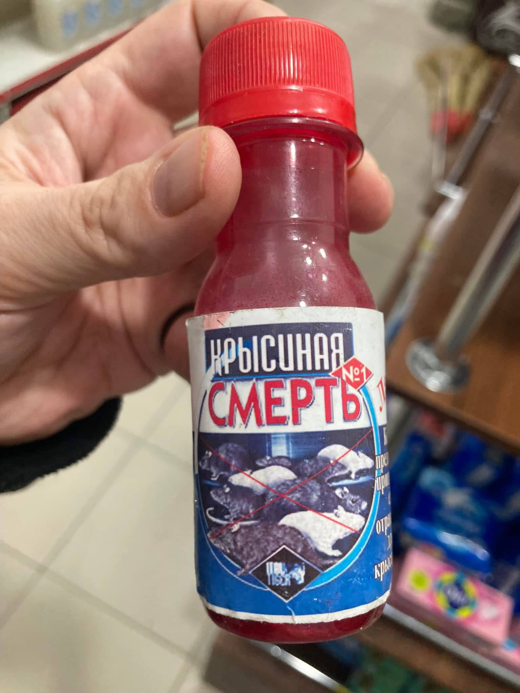

**Rat Death**

----

**Week of 15 — 21 May 2026**

Every week, I manually curate tools, research, and services that are genuinely useful for OSINT, digital investigations, security research, and adjacent fields.

No hype. No SEO noise. No "AI startups that change everything".  

Only things you can **open, verify, and actually use**.

----

## 🧭 Featured Project

### **Tesari — OSINT Copilot**

> A first step for investigations into organized crime, corruption, trafficking, and global risk networks.

**Tesari** is designed as an entry point into complex investigations: structure, context, and navigable intelligence instead of chaotic searching.

🔗 https://www.tesari.ai

----

## 🌍 Regional & Thematic OSINT

**Epstein Network.** This is a visualization of the people whose faces are in the [Epstein Library](https://www.justice.gov/epstein) dataset. The circles (nodes) are people, and the lines (edges) between them are when two people are in the same photograph together:

🔗 https://epstein.photos/

**Awesome Free SAAS.** an awesome list of free SaaS (software as a service) for you:

🔗 https://github.com/LlamaGenAI/awesome-free-saas

**Yosemite Crew** is an open-source operating system designed for animal health industry. At its core is a free, fully customizable Practice Management System (PMS) that unifies pet care operations, bringing together pet owners, pet businesses, and developers into one innovative ecosystem:

🔗 https://github.com/YosemiteCrew/Yosemite-Crew

**Translate Documents Online.** Upload a PDF, Word, or PowerPoint file, pick your language, and get it back translated - tables, images, and formatting all in place. Four translation engines, 100+ languages, done in seconds:

🔗 https://www.doctranslating.com/

----

**Copilot for Obsidian** is your in‑vault AI assistant with chat-based vault search, web and YouTube support, powerful context processing, and ever-expanding agentic capabilities within Obsidian's highly customizable workspace - all while keeping your data under **your** control.

🔗 Link: https://www.obsidiancopilot.com

🔗 GitHub: https://github.com/logancyang/obsidian-copilot

----

**OpenPostings** is an OpenSource ATS job aggregator and application tracking app. **It pulls jobs that were posted in the last 24 hours** or that has no posted date. 

Over 100000+ companies from multiple ATSs all sourced into 1 location:

🔗 https://github.com/Masterjx9/OpenPostings

----
## 🛠 OSINT Tools, Services & Investigations

**UrlVet (SafeSurf).** Open-source phishing detection engine - paste any URL and get a trust score, a fully explainable verdict, and a shareable security report with live page preview, all in real time:

🔗 https://github.com/abhizaik/urlvet

**FastALPR** is a high-performance, customizable Automatic License Plate Recognition (ALPR) system. We offer fast and efficient ONNX models by default, but you can easily swap in your own models if needed:

🔗 https://github.com/ankandrew/fast-alpr

**Leaf.** Terminal Markdown previewer, GUI-like experience:

🔗 https://github.com/RivoLink/leaf

**MetaRadar.** A tool for BLE environment monitoring. Find and track Bluetooth devices around, and get notified when the target device is detected:

🔗 https://github.com/BLE-Research-Group/MetaRadar

**YourSteaID.** Qt GUI application for downloading videos, playlists and monitoring streams:

🔗 https://github.com/ivan-an/YouStealD

**ShareTrace.** Reveal the identity behind a share link:

🔗 https://github.com/soxoj/sharetrace

**Twitter Profile History Lookup:**

🔗 https://twitter.lolarchiver.com/

**Web-Check.xyz** - X-Ray vision for Websites:

🔗 https://web-check.xyz/

**SpotiFLAG.** Get Spotify tracks in true FLAC from Tidal, Qobuz & Amazon Music - no account required:

🔗 https://github.com/spotbye/SpotiFLAC

----

## 🤖 Universal Search & AI

**Cronicle.** A simple, distributed task scheduler and runner with a web based UI:

🔗 https://github.com/jhuckaby/Cronicle

**Open Brain.** Semantic memory for AI agents. Postgres + pgvector + MCP. Capture, classify, retrieve:

🔗 https://github.com/shawnpetros/open-brain

**EverOS** is a unified home for applying, building, and evaluating long-term memory in self-evolving agents:

🔗 https://github.com/EverMind-AI/EverOS

**Playwright Computer Use.** Easily use the Claude `computer` tool to let an agent interact with a web browser on your machine (playwright):

🔗 https://github.com/invariantlabs-ai/playwright-computer-use

**Heym.** Self-hosted AI workflow automation platform with visual canvas, agents, RAG, HITL, MCP, and observability in one runtime:

🔗 https://github.com/heymrun/heym/

**OpenHands** Software Agent SDK. The SDK is a composable Python library that contains all of our agentic tech. It's the engine that powers everything else below. Define agents in code, then run them locally, or scale to 1000s of agents in the cloud:

🔗 https://github.com/OpenHands/OpenHands

**Agentic Inbox.** A self-hosted email client with an AI agent, running entirely on Cloudflare Workers:

🔗 https://github.com/cloudflare/agentic-inbox

**Steno** is the AI powered intelligence layer for all your confidential conversations. Capture beautiful notes whilst keeping your data confidential. Perfect for government, defence, legal and CXOs:

🔗 https://github.com/ruzin/stenoai

**Claude-red** is a curated library of offensive security skills designed for the Claude skills system. Each skill is a structured SKILL.md file that primes Claude with expert-level methodology for a specific attack surface - from SQLi to shellcode, EDR evasion to exploit development:

🔗 https://github.com/SnailSploit/Claude-Red

----

## 👨‍💻 Software Development & APIs

**DevDocs** combines multiple developer documentations in a clean and organized web UI with instant search, offline support, mobile version, dark theme, keyboard shortcuts, and more:

🔗 https://github.com/freeCodeCamp/devdocs

**Astro.** The web framework for content-driven websites. Astro powers the world's fastest marketing sites, blogs, e-commerce websites, and more:

🔗 https://astro.build/

**Pipedream** provides a free, hosted platform for connecting apps and developing event-driven automations. The platform has over 1,000 fully-integrated applications, so you can use pre-built components to quickly send messages to Slack, add a new row to Google Sheets, and more. You can also run any Node.js, Python, Golang, or Bash code when you need custom logic:

🔗 https://github.com/PipedreamHQ/pipedream

**OpenWA.** Free, Open Source, Self-Hosted WhatsApp API Gateway:

🔗 https://github.com/rmyndharis/OpenWA

----

## 🐧 Linux & DevOps

**The Zeal Operating System** is a modernized fork of the 64-bit Temple Operating System, TempleOS:

🔗 https://github.com/Zeal-Operating-System/ZealOS

**Nextcloud** server, a safe home for all your data:

🔗 https://github.com/nextcloud/server

**socktop** is a remote system monitor with a rich TUI interface, inspired by `top` and `btop`, that communicates with a lightweight remote agent over WebSockets:

🔗 https://github.com/jasonwitty/socktop

**DPI Checkers.** Repository contains checkers that allow you to determine if your residential ISP (or a server in a data center) has DPI, as well as the specific methods (and their parameters) the censor uses for restrictions:

🔗 https://github.com/hyperion-cs/dpi-checkers

**Terax AI.** Lightweight (7MB) AI terminal emulator (ADE) built in Rust & Tauri & React:

🔗 https://github.com/crynta/Terax-AI

----

## 🔌 Hardware & Devices

**Teleop.** Turns your phone or VR headset into a robot arm teleoperation device by leveraging WebXR:

🔗 https://github.com/SpesRobotics/teleop

**A 100-day challenge exploring IoT and embedded systems** using ESP32, ESP8266, and Raspberry Pi Pico with MicroPython. Each day covers a new sensor or module with complete code, circuit diagram, and explanation:

🔗 https://github.com/kritishmohapatra/100_Days_100_IoT_Projects

----

## 🚨 From CyberDetective

**OPENOSINT.** OSINT agent, MCP server, and CLI for Open Source Intelligence. Search info by email, username, domain and more:

🔗 https://openosint.tech/

----
## 📌 Where to Follow

🔗  **Substack:** https://osintech.substack.com  
🔗  **LinkedIn:** https://www.linkedin.com/in/osintech/details/featured/

If this timeline saves you time, it’s doing its job.  
Free to read. Manually curated. Minimal noise.

---

## 📌 Donates

---

## 📌 Legal and ethical note

All tools and techniques documented in the dataset are presented for informational,  
educational and information security purposes only.

The dataset does not promote or endorse illegal activities.  
Users are responsible for complying with applicable laws and ethical standards.

---

## 📌 About future updates

The dataset is updated on a regular basis.  
Future posts will document changes, notable additions and emerging trends observed within the dataset.

This post serves as an introduction and reference point for those updates.